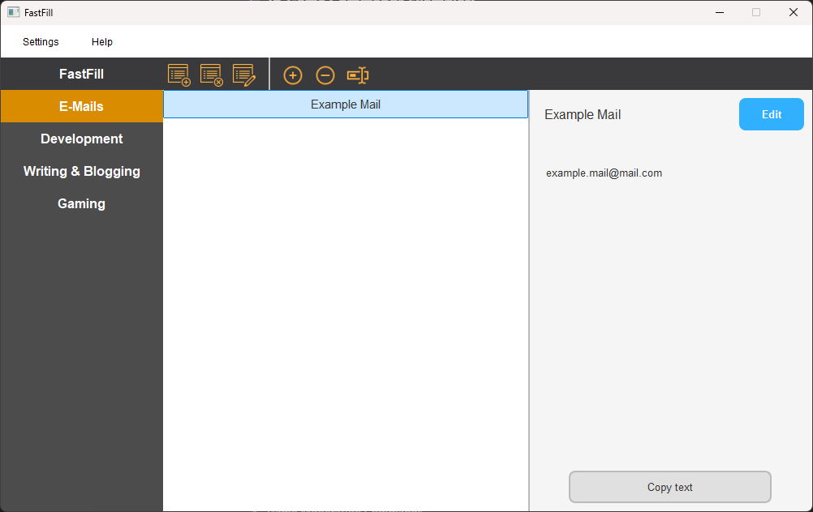
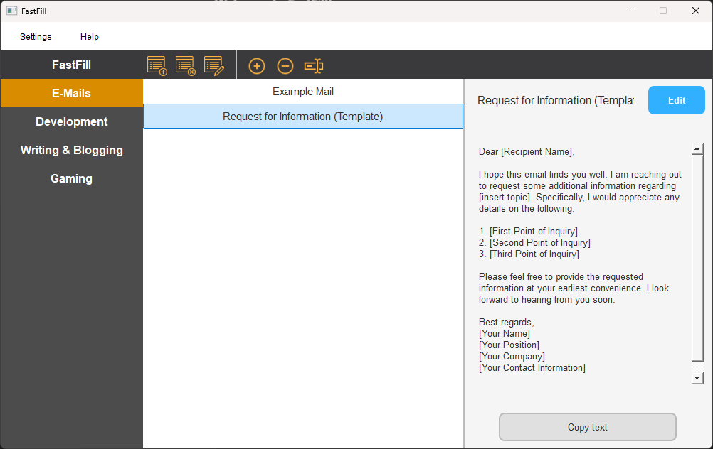

# FastFill

This is the **`main` branch**, containing the **stable version** of FastFill.  
✅ **This branch is protected** – only the repository owner can update it.  
🛠️ **Contributions should be made in the `develop` branch.**

---

## 📌 About FastFill

FastFill is a Windows application built using Python and PyQt5, designed to easily manage and copy frequently used texts - such as emails, templates, and more. It allows you to easily copy these texts to your clipboard for fast and efficient pasting, saving you time and effort.

## ✨ Features

FastFill allows you to efficiently manage frequently used texts and copy them directly to your clipboard for quick pasting.

- 🗂 **Organize categories** – Create, delete, rename, and organize them  
- 📝 **Manage text entries** – Add, remove, reorder, and rename saved texts  
- ⚙️ **Customizable settings** – Customizable settings designed for an intuitive and user-friendly experience
- 🎛 **System tray integration** – Quickly open, close, or restart the app

## 📥 Installation

To install FastFill, simply download the installer for Windows from the Releases page and run it.

- [Windows Installer](https://github.com/PaulK6803/FastFill/releases)

The [FastFillSetup.exe](https://www.virustotal.com/gui/file/5c1a77132cc664df032e7be7a5d1648dfb16803c4d223b5416173e8358cbc711?nocache=1) and [FastFill.exe]((https://www.virustotal.com/gui/file/ff45288f9d139e320bc313ddcd57e580ceda2fb4c876ed5f69364f0018857340?nocache=1)) has been scanned on VirusTotal and is safe to use. If your antivirus flags it, you can safely add it to your exclusions.

---

## Contributing

**🚫 Contributions cannot be made directly to `main`.**

🛠️ **To contribute, use the `develop` branch:**  

1. **Fork the repository** and create your feature branch from `develop`.  
2. **Make your changes** and test them thoroughly.  
3. **Submit a pull request (PR) to `develop`** with a clear description of your changes.  
4. **Ensure your changes comply with the [license](LICENSE.md) terms**, particularly regarding non-commercial use.

🔄 Once changes in `develop` are tested and stable, the repository owner will merge them into `main`.  

---

**License**

By submitting a pull request, you agree that your contributions will be licensed under the same license as the project (CC BY-NC 4.0).

**Code of Conduct**

We follow a code of conduct that encourages respectful and inclusive contributions. Please make sure to engage in a manner that fosters collaboration and respect.
